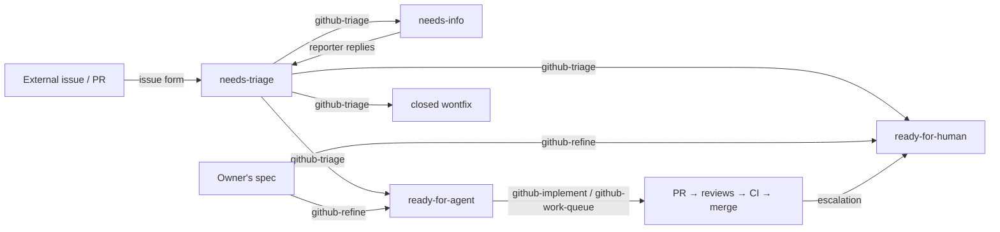

# Claude Code personal configuration

Versioned subset of `~/.claude`: my engineering baseline and the skills that apply it. The repo
lives in place, so Claude Code loads it directly in every session.

## At a glance

- **What it is**: a methodology, not an application — a personal engineering baseline
  ([`CLAUDE.md`](CLAUDE.md)) plus skills that set up repositories against it and run a
  GitHub-native triage → refine → implement → review → merge loop, autonomously where a repo allows it.
- **Use it**: in any repo, `/quality-baseline` to set up or audit quality gates, then
  `/github-workflow-setup` to enable the issue workflow. See [Setting up a repository](#setting-up-a-repository).
- **Quality**: documentation checks in CI ([Docs workflow](.github/workflows/docs.yml)); behavioural
  scenarios per workflow skill (`skills/*/evals/`); decisions in [docs/decisions/](docs/decisions/README.md).

## Contents

| Path | What it is |
|---|---|
| [`CLAUDE.md`](CLAUDE.md) | Personal baseline and working agreements, applied to every repository. |
| `skills/<name>/SKILL.md` | One skill per folder; `references/`, `templates/` and `evals/` beside it. |
| [`docs/decisions/`](docs/decisions/README.md) | ADRs for this repository. |
| [`docs/credits.md`](docs/credits.md) | Prior art the GitHub workflow skills are modeled on. |
| [`docs/upstream-watch.md`](docs/upstream-watch.md) | How far `check-upstream-skills` has reviewed upstream. |
| [`.github/`](.github/) | Docs CI, its validation script, Dependabot and the ruleset to apply once public. |

Everything else in `~/.claude` (history, sessions, caches, `settings.json`) is private runtime
state, excluded by the whitelist in [`.gitignore`](.gitignore).

## Skills

**Starts automatically** means Claude may invoke the skill on its own when the request matches its
`description`; every skill can also be started explicitly with `/<name>`. **Manual only** skills
set `disable-model-invocation: true`: only typing the slash command starts them.

| Skill | Use it to | Starts | Notes |
|---|---|---|---|
| [`quality-baseline`](skills/quality-baseline/SKILL.md) | Set up or audit a repo against the baseline (tests, CI gates, pre-push, rulesets, Docker, ADRs…). | Automatically | C# templates in `templates/csharp/`; language references in `references/`. |
| [`adr`](skills/adr/SKILL.md) | Write, propose, supersede or list ADRs (MADR 4.0). | Automatically | |
| [`github-workflow-setup`](skills/github-workflow-setup/SKILL.md) | Set up or audit a repo's issue workflow; or get a reminder of the cycle. | Automatically | Asks before widening any permission. |
| [`github-triage`](skills/github-triage/SKILL.md) | Classify incoming external issues and PRs. | Automatically | Proposes; applies only after approval. |
| [`github-refine`](skills/github-refine/SKILL.md) | Turn an agreed spec into a milestone of tracer-bullet issues. | Automatically | Shows the draft before publishing. |
| [`github-implement`](skills/github-implement/SKILL.md) | Implement one `ready-for-agent` issue with TDD, up to an open PR. | Automatically, e.g. `/github-implement 42` | Runs in a forked context; needs the issue number. |
| [`github-work-queue`](skills/github-work-queue/SKILL.md) | Work through the `ready-for-agent` backlog unattended. | **Manual only** | Merges PRs where the repo allows it. |
| [`check-upstream-skills`](skills/check-upstream-skills/SKILL.md) | Review [mattpocock/skills](https://github.com/mattpocock/skills) for improvements. | **Manual only** | Occasional, on demand. |

The built-in `code-review` and `security-review` skills are reused as the review gate of the work
queue.

## Setting up a repository

Requirements: Claude Code, the [GitHub CLI](https://cli.github.com/) authenticated with access to
the repo (`gh auth status`), and — for branch rulesets — a public repo or a paid GitHub plan.

1. **Quality baseline** — `/quality-baseline`. Detects what exists, agrees a plan with you, then
   scaffolds tests, CI, pre-push hook, rulesets, Docker, README, repo `CLAUDE.md` and
   `.claude/settings.json`. What it applies: [`CLAUDE.md`](CLAUDE.md) › *Baseline* and
   [`references/common.md`](skills/quality-baseline/references/common.md).
2. **Issue workflow** — `/github-workflow-setup`. Creates the
   [labels](skills/github-workflow-setup/references/labels.md), `docs/agents/workflow.md` (from
   [the template](skills/github-workflow-setup/templates/workflow.md)), the
   [issue forms](skills/github-workflow-setup/templates/ISSUE_TEMPLATE/) and the
   [`needs-info-reply` workflow](skills/github-workflow-setup/templates/workflows/needs-info-reply.yml).
3. **Autonomy** — during step 2 it asks whether agents may push and merge in that repo and writes
   the answer in three places that must agree: the repo's `CLAUDE.md`, its `.claude/settings.json`
   and `docs/agents/workflow.md`. Details: [`references/autonomy.md`](skills/github-workflow-setup/references/autonomy.md);
   rationale: [ADR 0002](docs/decisions/0002-per-repository-push-and-merge-policy.md). A repo
   without a policy means "ask before every push".

Re-run either skill at any time to audit the repo; `github-workflow-setup` with nothing to change
just explains the cycle.

### Adopting it in an existing repository

Both skills start with an audit when the repo already has content: they report what is present,
missing or deviating, agree a plan with you, and only then change things. Existing files are
merged into, never overwritten. A practical order, one commit (or PR, per the repo's rules) per step:

1. **Audit first** — `/quality-baseline` in audit mode. Expect a checklist, not changes.
2. **Record the current shape** — for the main past decisions nobody wrote down, write retroactive
   ADRs before changing them (`adr` skill › *Brownfield*; `common.md` › *Decision log*).
3. **Formatting alone** — apply the formatter once in a commit of its own, apart from behaviour
   changes, so history stays readable.
4. **Gates without a red build** — when coverage starts below 80%, publish it with threshold 0 and
   raise it in the step that adds the missing tests; for C#, see
   [`csharp.md` › *Migrating an existing repo*](skills/quality-baseline/references/csharp.md)
   (e.g. xUnit v2 → v3). Add each CI gate when the code already passes it.
5. **Repo docs** — restructure the existing README to the baseline order, keeping its content;
   add a short `CLAUDE.md` with the push policy and any baseline overrides (with the reason).
6. **Issue workflow** — `/github-workflow-setup`. Existing labels are kept (colours/descriptions
   updated only with your OK); the open backlog is proposed in one table for approval —
   external reports to `needs-triage`, your own issues to `github-refine` or a brief — and closed
   issues are left alone.
7. **Autonomy last** — start with `Unattended merge: no` or a supervised push policy, run
   `/github-implement <issue>` on a couple of tickets, and widen autonomy once the reviews and
   CI behave as expected.

## How the GitHub workflow works

Design: [ADR 0001](docs/decisions/0001-github-driven-triage-refinement-and-autonomous-implementation.md).



- **Mapping**: milestone = spec/epic; issue = tracer-bullet ticket
  ([slicing rules](skills/github-refine/references/tracer-bullets.md)); "blocked by" = GitHub's
  native issue dependencies ([how they're written and checked](skills/github-workflow-setup/references/dependencies.md)).
- **States**: [triage state machine](skills/github-triage/references/states.md). Each issue
  ready for work carries an [agent brief](skills/github-triage/references/brief-format.md):
  acceptance criteria, what was verified, and the *Sensitive areas* pre-approved for the agent.
- **Autonomy has three layers**: per issue (`ready-for-agent` vs `ready-for-human`), per repo
  (push policy and `Unattended merge` in `docs/agents/workflow.md`), and GitHub's own ruleset
  (required checks, no force-push), which agent merges never bypass.
- **Per-ticket loop** of the work queue: implement in a subagent → `code-review` and
  `security-review` in parallel, each in its own worktree on the PR branch → one fix round →
  CI → merge or hand off → recompute the frontier. A stuck ticket is relabeled `ready-for-human`
  with a comment and the queue moves on. Details: [queue policy](skills/github-work-queue/references/queue-policy.md);
  stop conditions: [delivery](skills/github-implement/references/delivery.md).
- **What touches GitHub**, all through `gh`:

  | Skill | Reads | Writes |
  |---|---|---|
  | `github-workflow-setup` | labels, rulesets | labels (after confirmation) |
  | `github-triage` | issues, PR diffs (never checks out or runs external PRs) | labels, comments, closes `wontfix` — after approval |
  | `github-refine` | milestones | milestone, issues, dependencies — after approval |
  | `github-implement` | issue, dependencies | branch push, PR (only if the push policy allows) |
  | `github-work-queue` | issues, PR checks | merges, relabels escalated issues |

- **Notifications**: GitHub's own. The triage comment on a `needs-info` issue notifies the
  reporter; their reply notifies you and the `needs-info-reply` workflow sends it back to
  `needs-triage`. Escalated tickets get a comment explaining why.

## Changing this repository

- **Conventions**: skills in English, one folder each, `SKILL.md` kept short with detail in
  `references/`. Architecturally significant changes get an ADR (`adr` skill).
- **Checks**: `python3 .github/scripts/validate.py` (skill frontmatter, relative links, YAML/JSON)
  and `shellcheck` on template scripts — the same as the [Docs workflow](.github/workflows/docs.yml).
- **Behaviour**: before a significant edit to a workflow skill, walk through its
  `evals/scenarios.md` and confirm each expected behaviour still holds.
- **Upstream**: `/check-upstream-skills` now and then; credits in [docs/credits.md](docs/credits.md).

### Overrides of the baseline

This repo holds documentation and templates, not an application, so:

| Baseline item | Here | Why |
|---|---|---|
| Unit/component/load tests, SLO, coverage | Behavioural scenarios (`evals/`) | Skills are prose; templates are verified in the repos they come from. |
| Build, CodeQL, Docker | Docs CI (frontmatter, links, YAML/JSON, shellcheck) | No executable product. |
| One PR per step, review via PR | Direct commits to `main` by the owner (ruleset bypass); PRs for everyone else | Single maintainer, nothing for PR CI to gate beyond the docs checks. |
| Pre-push hook | Run `validate.py` manually | A hook needs `core.hooksPath` in `.git/config`, which isn't versioned. |
| Push policy | Ask before every push | Default from [ADR 0002](docs/decisions/0002-per-repository-push-and-merge-policy.md). |

### Repository protection

The repo is public; the versioned files contain no personal data beyond my name and GitHub
username, and commits use the GitHub noreply email. `main` is protected by the ruleset in
`.github/rulesets/main.json` (applied with
`gh api -X POST repos/{owner}/{repo}/rulesets --input .github/rulesets/main.json`): no deletion or
force-push; everyone else goes through a PR with the docs check green, while the repo admin
bypasses it to commit directly. Secret scanning with push protection is enabled.

## New machine

```bash
git clone https://github.com/alvaromongon/claude-config.git /tmp/claude-config
cp -R /tmp/claude-config/. ~/.claude/
```

## AI-assisted development

This repository is written with Claude Code, following the same working agreements it defines:
analysis and alternatives discussed before non-trivial changes, decisions recorded as ADRs, and
every change reviewed by me before it's pushed.
